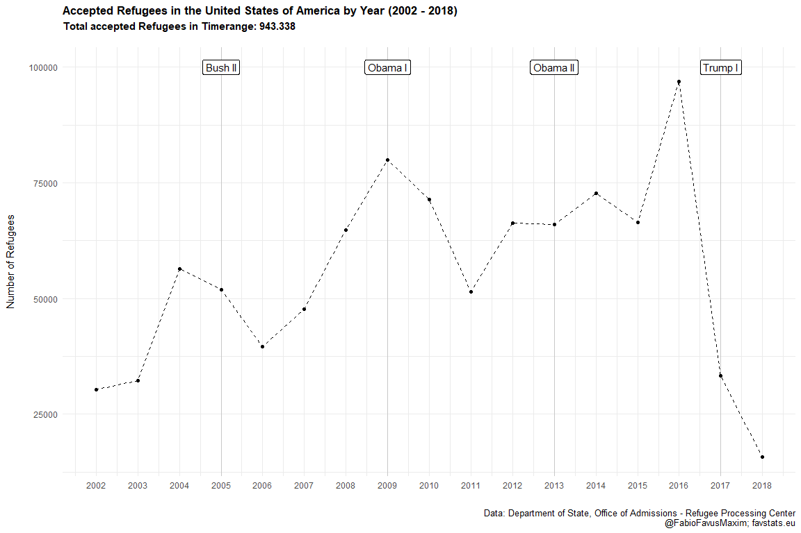
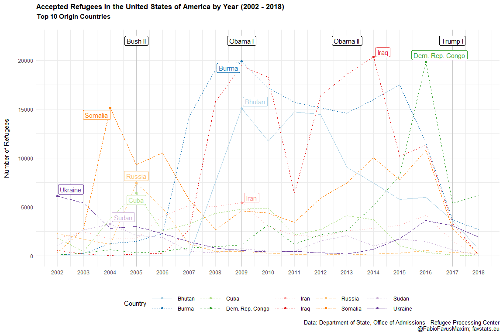

Accepted Refugees United States
================
Fabio Votta
21.09.2018

Data from:
<http://ireports.wrapsnet.org/Interactive-Reporting/EnumType/Report?ItemPath=/rpt_WebArrivalsReports/MX%20-%20Arrivals%20by%20Nationality%20and%20Religion>

## Packages and Folders

``` r
# Install these packages if you don't have theme yet
# devtools::install_github("favstats/tidytemplate")
# install.packages("pacman")

pacman::p_load(tidyverse, readxl, sjmisc)

# Creates folders
# tidytemplate::data_dir()
# tidytemplate::images_dir()
```

## Load Data

``` r
refugee_dat <- read_excel("data/refugee_dat.xls") %>% 
  drop_na(X__1) %>% 
  rename(cntry = X__1) %>% 
  select(-Religion, -X__2, -X__3, - Total) %>% 
  filter(!(str_detect(cntry, "Total|Data"))) %>% 
  gather(year, n, -cntry) %>% 
  mutate(year = str_replace(year, "CY ", "") %>% as.numeric)

refugee_dat %>% group_by(cntry) %>% tally() %>% arrange(desc(nn)) %>% .[1:10,] %>% .$cntry -> top10
```

    ## Using `n` as weighting variable

## Static

``` r
year_dat <- tibble(year = c(2005, 2009, 2013, 2017), label = c("Bush II", "Obama I", "Obama II", "Trump I"))


refugee_total <- refugee_dat %>% 
  group_by(year) %>% 
  tally() %>% 
  ggplot(aes(year, nn)) +
  geom_vline(data = year_dat, aes(xintercept = year), alpha = 0.15) +
  geom_label(data = year_dat, aes(x = year, y = 100000, label = label), 
            angle = 0, color = "black") +
  geom_line(linetype = "dashed") + 
  geom_point() +
  theme_minimal() +
  scale_color_manual("Country", values = qualitative) +
  theme(plot.title = element_text(size = 13, face = "bold"),
    plot.subtitle = element_text(size = 11, face = "bold"), 
    plot.caption = element_text(size = 10),
        legend.position = "bottom") +
  scale_x_continuous(breaks = 2002:2018, labels = 2002:2018) +
  labs(x = "", y = "Number of Refugees\n", 
       title = "Accepted Refugees in the United States of America by Year (2002 - 2018)", 
       subtitle = "Total accepted Refugees in Timerange: 943.338\n",
       caption = "Data: Department of State, Office of Admissions - Refugee Processing Center\n@FabioFavusMaxim; favstats.eu")
```

    ## Using `n` as weighting variable

``` r
refugee_total
```



``` r
tidytemplate::ggsave_it(refugee_total, width = 10, height = 6)
```

## Colored

``` r
qualitative <- c('#a6cee3','#1f78b4','#b2df8a','#33a02c','#fb9a99','#e31a1c','#fdbf6f','#ff7f00','#cab2d6','#6a3d9a')

gg_refugee_static_data <- refugee_dat %>% 
  filter(cntry %in% top10) 

label_dat <- gg_refugee_static_data %>% 
  group_by(cntry) %>% 
  summarize(n = max(n)) %>% 
  select(-cntry) %>% 
  inner_join(gg_refugee_static_data)
```

    ## Joining, by = "n"

``` r
gg_refugee_static <- gg_refugee_static_data %>% 
  ggplot(aes(year, n)) +
  geom_vline(data = year_dat, aes(xintercept = year), alpha = 0.15) +
  geom_label(data = year_dat, aes(x = year, y = 22000, label = label), 
            angle = 0, color = "black") +
  geom_line(aes(linetype = cntry, color = cntry)) +
  theme_minimal() +
  ggrepel::geom_label_repel(data = label_dat, aes(label = cntry, color = cntry), show.legend = F) + 
  geom_point(data = label_dat, aes(color = cntry)) + 
  scale_color_manual("Country", values = qualitative) +
  scale_linetype("Country") +
  theme(plot.title = element_text(size = 13, face = "bold"),
    plot.subtitle = element_text(size = 11, face = "bold"), 
    plot.caption = element_text(size = 10),
    legend.key.width = unit(3, "line"),
    legend.position = "bottom") +
  scale_x_continuous(breaks = 2002:2018, labels = 2002:2018) +
  labs(x = "", y = "Number of Refugees\n", 
       title = "Accepted Refugees in the United States of America by Year (2002 - 2018)", subtitle = "Top 10 Origin Countries\n",
       caption = "Data: Department of State, Office of Admissions - Refugee Processing Center\n@FabioFavusMaxim; favstats.eu") 
  # geom_rect(aes(xmin = 2002, xmax = 2005, ymin = 22000, ymax = 22000),
  #             color = "black",
  #             alpha = 0.8,
  #             inherit.aes = FALSE)

gg_refugee_static
```



``` r
tidytemplate::ggsave_it(gg_refugee_static, width = 12, height = 8)
```

## Animated

``` r
library(gganimate)

gg_refugee <- refugee_dat %>%
  filter(cntry %in% top10) %>%
  ggplot(aes(year, n, color = cntry)) +
  geom_vline(data = year_dat, aes(xintercept = year), alpha = 0.15) +
  geom_label(data = year_dat, aes(x = year, y = 22000, label = label),
            angle = 0, color = "black") +
  geom_line() +
  geom_segment(aes(xend = 2018, yend = n), alpha = 0.5) +
  geom_point() +
  geom_text(aes(x = 2019, label = cntry)) +
  theme_minimal() +
  scale_color_manual("Country", values = qualitative) +
  theme(plot.title = element_text(size = 13, face = "bold"),
    plot.subtitle = element_text(size = 12, face = "bold"),
    plot.caption = element_text(size = 10),
        legend.position = "bottom") +
  scale_x_continuous(breaks = 2002:2018, labels = 2002:2018) +
  labs(x = "", y = "Number of Refugees\n",
       title = "Accepted Refugees in the United States of America by Year (2002 - 2018)", subtitle = "Top 10 Origin Countries\n",
       caption = "Data: Department of State, Office of Admissions - Refugee Processing Center\n@FabioFavusMaxim; favstats.eu")  +
  guides(color = F, text = F) +
  transition_reveal(cntry, year, keep_last = T)

gg_refugee %>% animate(
  nframes = 500, fps = 15, width = 1000, height = 600, detail = 1
)

anim_save("images/gg_refugee.gif")
```


