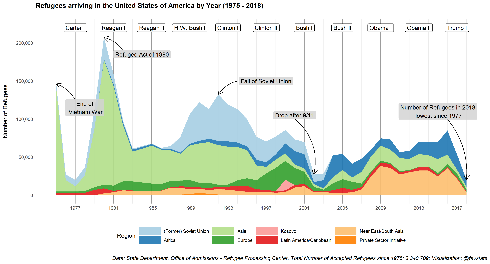
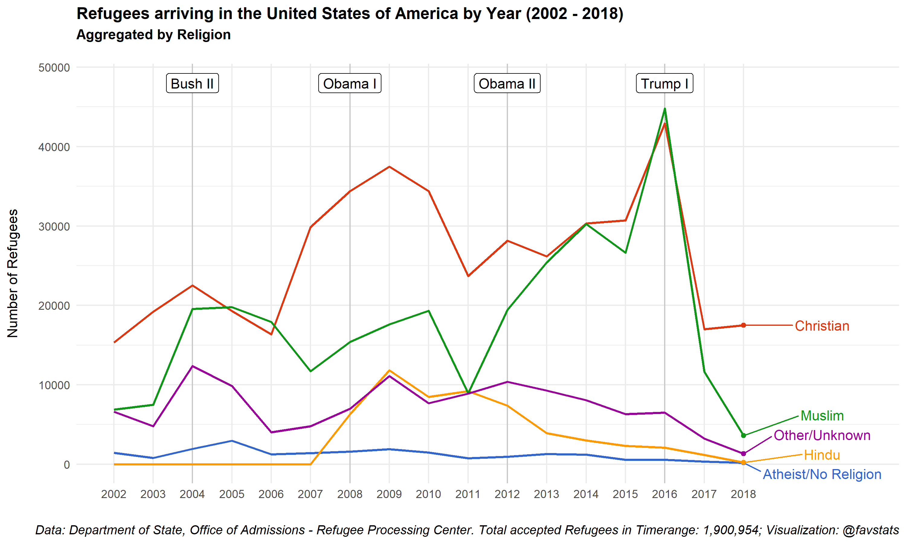
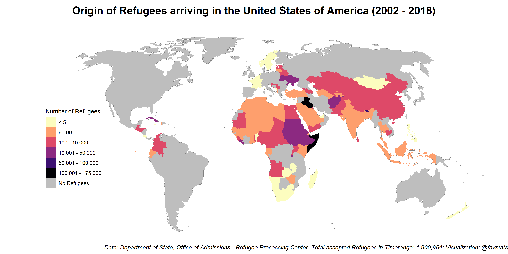
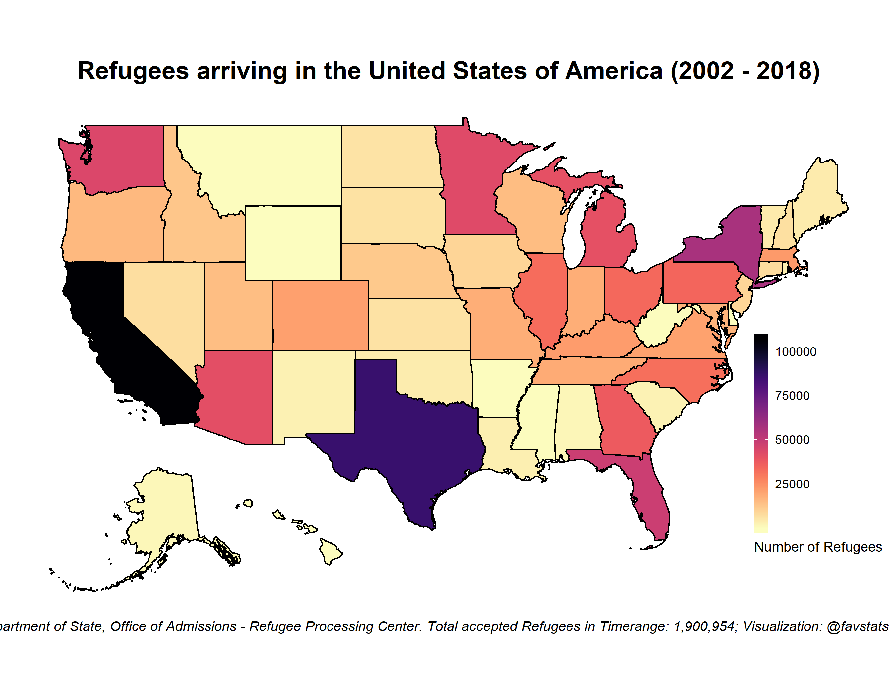
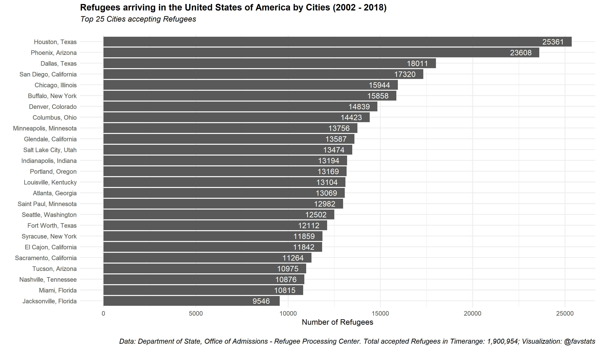

Exploring U.S. Refugee Data
================

### A Short History of Refugees in the U.S.

The United States has a long history of accepting refugees fleeing war,
violence or persecution. From the aftermath of World War II to wars in
Asia and the collapse of the Soviet bloc, there has not been a shortage
of people seeking to escape dire conditions and applying for refugee
status in the United States. According to State Department data, more
than 3.3 million refugees have been resettled in the United States since
1975.

After the Vietnam War and the record high number of refugees from
Southeast Asia, Congress passed the Refugee Act of 1980 (signed into law
by President Jimmy Carter), which established the Office of Refugee
Resettlement, standardized the refugee admission process and serves as
the legal basis for the U.S. Refugee Admissions Program (USRAP) to this
day. The year the law passed, refugee admissions peaked at an all-time
historic high with more than 200,000 individuals being admitted to the
U.S., largely from Southeast Asia.

With the fall of the Soviet Union and the collapse of the Eastern bloc,
refugee numbers peaked again in the early to mid-1990s with a total of
776.000 arrivals between the period of 1990 and 1996. Out of those, 40%
came from the Soviet Union or countries previously under its control.
Between 1997 and 2000, another 300.000 refugees arrived, mostly from
Europe (37%) due to the wars in former Yugoslavia. Since then, refugee
admissions from Europe have decreased significantly – only 8% of all
refugees resettled in the U.S. between 2001 and 2018 came from Europe.

After the 9/11 attacks, refugee numbers experienced a significant drop
as President George W. Bush halted admission processes for several
months. In 2002 and 2003, the U.S. took in fewer than 29.000 refugees
each year, down from 70.000 admissions in 2001.

Starting in 2004, refugee admissions started to increase again. Almost
half, 50.000 out of 107.000 refugees in 2004 and 2005, came from Africa
alone. In the following years, African refugees are increasingly
becoming a greater share of all admitted refugees.

During the Obama administration, admissions mostly stayed between 55,000
and 85,000 refugees per year. In 2016, President Obama raised the number
of refugees by 5,000 (from a previous ceiling of 80,000) to account for
the refugee crisis caused by the escalating conflict in Syria. In order
to adequately respond to the crisis, the ceiling for accepted refugees
was supposed to be raised from 85,000 to 110,000 refugees in the fiscal
year 2017.

However, the Trump administration discarded the suggested ceiling and
even set the cap to 50,000 refugees for fiscal 2017. Trump lowered the
cap again for fiscal 2018 to 45,000 admissions, although the actual
number of refugees that were resettled in 2018 was less than 20.000: the
lowest number since 1977. Coming up in 2019, the cap is going to be set
at 30,000 which is the lowest number since the existence of the program.

### Who are the Refugees

The state department provides us with some demographic information about
the refugees from 2002 onwards. Except for three years (2005, 2006 and
2016), most of the admitted refugees in each year were Christian. Here
too, we can see a sharp decline once the Trump administration lowered
the cap in 2017 and 2018.

While the ratio of accepted Muslim (46%) and Christian refugees (44%) in
2016 was almost equal, Muslim refugee admissions dropped to 35% in 2017
and 16% in 2018, despite the fact that a significant chunk of global
refugees are from countries where Islam is the predominant religion. The
majority of Muslim refugees in 2018 came from Myanmar (1117 individuals
or 31% of all Muslim refugees that year), fleeing an ethnic cleansing
campaign that killed thousands. The next largest groups of Muslims in
2018 are from Afghanistan (806 refugees or 22%) and the Democratic
Republic Congo (422 or
12%).

But the Trump administration did not only cut back on Muslim refugees.
Despite vows to protect persecuted Christians all around the world and
greater acceptance rates than their Muslim counterparts, the lowered cap
slashed the number of accepted Christian refugees by more than half
since 2016: from 43,000 Christians in 2016 to 17,000 in 2017 and 2018,
respectively.

When it comes to gender, the balance is quite equal with slightly more
men than women admitted as refugees (52% male). The largest group of
refugees admitted between 2002 and 2018 is below 14 (30%) and roughly
half of all refugees are 20 years old or
younger.

The U.S. department of state also provides us with data concerning
education levels of admitted refugees. The largest group has completed
secondary education at the very least (29%), followed by primary
education (26%). 9% of all resettled refugees have a University-level
degree.

### Where do Refugees come from?

Given the current Government shutdown over a border wall, one might
expect that there are many refugees from South America. A look at the
data reveals that the U.S. barely takes any refugees from South America.
Why is that the case?

The United States differentiates between refugees and asylum seekers. A
refugee is defined as as any person that “has a well-founded fear of
persecution on account of race, religion, nationality, membership in a
particular social group, or political opinion.”

Refugees are typically admitted through the UNHCR’s Resettlement Program
after their refugee status has been assessed and they have been vetted
by the State Department, a process that takes at least 18 months. While
many immigrants, legal and undocumented, come from Central and South
America, U.S. regulations make it difficult for them to qualify as
refugees as they have to present themselves at a port of entry or be
within the territory of the U.S. to become asylum seekers (which refers
to a different process).

### Where do Refugees go?

Finally, one can ask where the admitted refugees will go. Most refugees
from 2002 to 2018 were admitted in California. 11% of all refugees or
107,000 individuals were admitted there. California is followed by Texas
with 9% of all refugees. With over 25,000 individuals, Houston is also
the city with most refugees in the United States (Dallas is on the third
place with 18,000 individuals). The lowest number of accepted refugees
were taken in by the state of Hawaii with 127 refugees, Mississippi with
121 refugees and Wyoming with 6 individuals resettled between 2002 and
2018.

