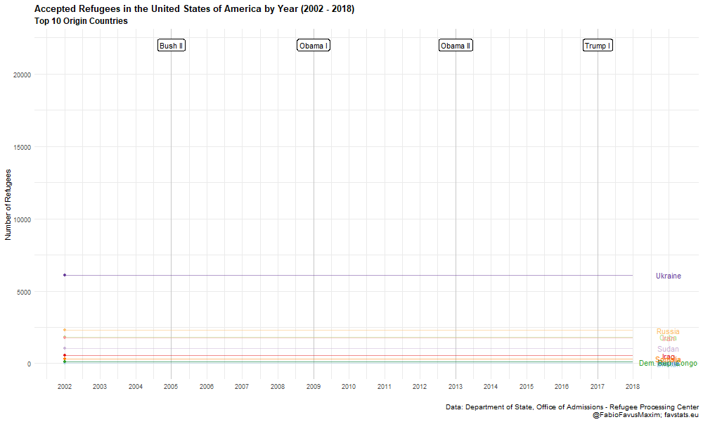
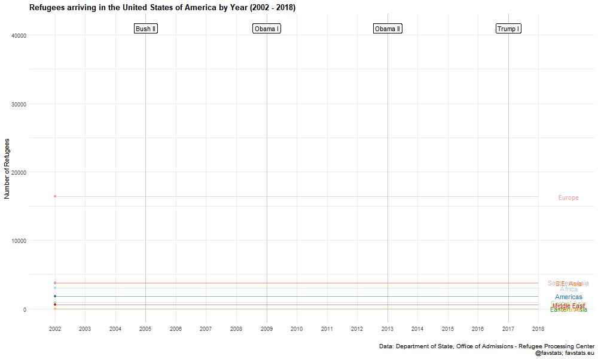
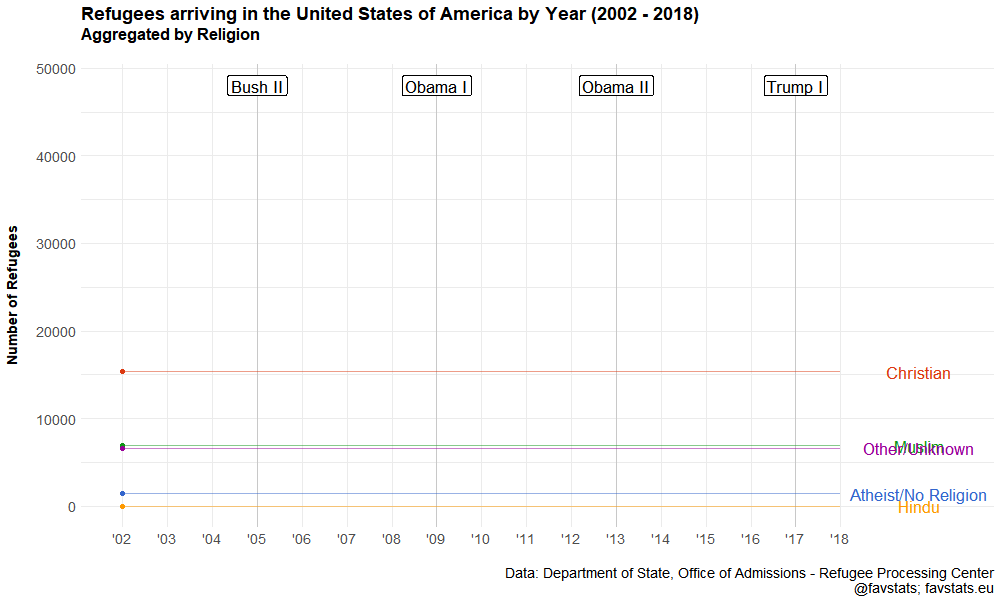

Data from: http://ireports.wrapsnet.org/Interactive-Reporting/EnumType/Report?ItemPath=/rpt_WebArrivalsReports/MX%20-%20Arrivals%20by%20Nationality%20and%20Religion

## Packages and Folders

```{r}
options(scipen = 999)
# Install these packages if you don't have theme yet
# devtools::install_github("favstats/tidytemplate")
# devtools::install_github("UrbanInstitute/urbnmapr")
# install.packages("pacman")

pacman::p_load(tidyverse, readxl, sjmisc, urbnmapr, tabulizer, viridis, countrycode)

# Creates folders
# tidytemplate::data_dir()
# tidytemplate::images_dir()
```


## Load Data

```{r, data}
refugee_dat <- read_excel("data/refugee_dat.xls", skip = 1) %>% 
  drop_na(X__1) %>% 
  rename(cntry = X__1) %>% 
  select(-Religion, -X__2, -X__3, - Total) %>% 
  filter(!(str_detect(cntry, "Total|Data"))) %>% 
  gather(year, n, -cntry) %>% 
  mutate(year = str_replace(year, "CY ", "") %>% as.numeric)

refugee_dat %>% group_by(cntry) %>% tally() %>% arrange(desc(nn)) %>% .[1:10,] %>% .$cntry -> top10

year_dat <- tibble(year = c(2005, 2009, 2013, 2017), label = c("Bush II", "Obama I", "Obama II", "Trump I"))

qualitative <- c('#a6cee3','#1f78b4','#b2df8a','#33a02c','#fb9a99','#e31a1c','#fdbf6f','#ff7f00','#cab2d6','#6a3d9a')


```


## Static

```{r, fig.width=12, fig.height=8, fig.align='center'}
refugee_total <- refugee_dat %>% 
  group_by(year) %>% 
  tally() %>% 
  ggplot(aes(year, nn)) +
  geom_vline(data = year_dat, aes(xintercept = year), alpha = 0.15) +
  geom_label(data = year_dat, aes(x = year, y = 100000, label = label), 
            angle = 0, color = "black") +
  geom_line(linetype = "dashed") + 
  geom_point() +
  theme_minimal() +
  scale_color_manual("Country", values = qualitative) +
  theme(plot.title = element_text(size = 13, face = "bold"),
    plot.subtitle = element_text(size = 11, face = "bold"), 
    plot.caption = element_text(size = 10),
        legend.position = "bottom") +
  scale_x_continuous(breaks = 2002:2018, labels = 2002:2018,
                     minor_breaks = seq(2002, 2018, 1)) +
  labs(x = "", y = "Number of Refugees\n", 
       title = "Refugees arriving in the United States of America by Year (2002 - 2018)", 
       subtitle = "Total accepted Refugees in Timerange: 943.338\n",
       caption = "Data: Department of State, Office of Admissions - Refugee Processing Center\nfavstats.eu; @favstats")

refugee_total

tidytemplate::ggsave_it(refugee_total, width = 10, height = 6)

```

## Colored


```{r, fig.width=12, fig.height=8, fig.align='center'}
gg_refugee_static_data <- refugee_dat %>% 
  filter(cntry %in% top10) 

label_dat <- gg_refugee_static_data %>% 
  group_by(cntry) %>% 
  summarize(n = max(n)) %>% 
  select(-cntry) %>% 
  inner_join(gg_refugee_static_data)


gg_refugee_static <- gg_refugee_static_data %>% 
  ggplot(aes(year, n)) +
  geom_vline(data = year_dat, aes(xintercept = year), alpha = 0.15) +
  geom_label(data = year_dat, aes(x = year, y = 22000, label = label), 
            angle = 0, color = "black") +
  geom_line(aes(linetype = cntry, color = cntry)) +
  theme_minimal() +
  ggrepel::geom_label_repel(data = label_dat, aes(label = cntry, color = cntry), show.legend = F) + 
  geom_point(data = label_dat, aes(color = cntry)) + 
  scale_color_manual("Country", values = qualitative) +
  scale_linetype("Country") +
  theme(plot.title = element_text(size = 13, face = "bold"),
    plot.subtitle = element_text(size = 11, face = "bold"), 
    plot.caption = element_text(size = 10),
    legend.key.width = unit(3, "line"),
    legend.position = "bottom") +
  scale_x_continuous(breaks = 2002:2018, labels = 2002:2018,
                     minor_breaks = seq(2002, 2018, 1)) +
  labs(x = "", y = "Number of Refugees\n", 
       title = "Refugees arriving in the United States of America by Year (2002 - 2018)", subtitle = "Top 10 Origin Countries\n",
       caption = "Data: Department of State, Office of Admissions - Refugee Processing Center\nfavstats.eu; @favstats") 
  # geom_rect(aes(xmin = 2002, xmax = 2005, ymin = 22000, ymax = 22000),
  #             color = "black",
  #             alpha = 0.8,
  #             inherit.aes = FALSE)

gg_refugee_static

tidytemplate::ggsave_it(gg_refugee_static, width = 12, height = 8)
```

## Animated

```{r, eval = F}
library(gganimate)

gg_refugee <- refugee_dat %>%
  filter(cntry %in% top10) %>%
  ggplot(aes(year, n, color = cntry)) +
  geom_vline(data = year_dat, aes(xintercept = year), alpha = 0.15) +
  geom_label(data = year_dat, aes(x = year, y = 22000, label = label),
            angle = 0, color = "black") +
  geom_line() +
  geom_segment(aes(xend = 2018, yend = n), alpha = 0.5) +
  geom_point() +
  geom_text(aes(x = 2019, label = cntry)) +
  theme_minimal() +
  scale_color_manual("Country", values = qualitative) +
  theme(plot.title = element_text(size = 13, face = "bold"),
    plot.subtitle = element_text(size = 12, face = "bold"),
    plot.caption = element_text(size = 10),
        legend.position = "bottom") +
  scale_x_continuous(breaks = 2002:2018, labels = 2002:2018,
                     minor_breaks = seq(2002, 2018, 1)) +
  labs(x = "", y = "Number of Refugees\n",
       title = "Refugees arriving in the United States of America by Year (2002 - 2018)", subtitle = "Top 10 Origin Countries\n",
       caption = "Data: Department of State, Office of Admissions - Refugee Processing Center\nfavstats.eu; @favstats")  +
  guides(color = F, text = F) +
  transition_reveal(cntry, year, keep_last = T)

gg_refugee %>% animate(
  nframes = 500, fps = 15, width = 1000, height = 600, detail = 1
)

anim_save("images/gg_refugee.gif")

```


 


## Region

### Static

```{r, fig.width=12, fig.height=8, fig.align='center'}
gg_refugee_static_region <- refugee_dat %>% 
  mutate(continent = countrycode::countrycode(cntry, "country.name", "continent")) %>% 
  mutate(region = countrycode::countrycode(cntry, "country.name", "region")) %>%
  mutate(continent = case_when(
    continent == "Asia" ~ region,
    T ~ continent
  )) %>% 
  mutate(continent = case_when(
    cntry == "Tibet" ~ "Eastern Asia",
    cntry == "Yemen (Sanaa)" ~ "Middle East",
    cntry == "Yugoslavia" ~ "Europe",
    str_detect(cntry, "Georgia|Armenia|Azerbaijan") ~ "Central Asia",
    continent == "Western Asia" ~ "Middle East",
    T ~ continent
  )) %>% 
  # group_by(continent) %>% tally
  # filter(continent == "Western Asia")
  group_by(year, continent) %>% 
  tally() 
  
# gg_refugee_static_region %>% filter(continent == "Southern Asia") %>% summarize_all(sum)
  
label_dat <- gg_refugee_static_region %>% 
  group_by(continent) %>% 
  summarize(nn = max(nn)) %>% 
  select(-continent) %>% 
  inner_join(gg_refugee_static_region) %>% 
  filter(!(year == 2018 & continent == "Eastern Asia")) %>% 
  filter(!(year == 2004 & continent == "Eastern Asia")) %>% 
  mutate(nn = ifelse(continent == "Southern Asia", 10385, nn)) %>% 
  mutate(year = ifelse(continent == "Southern Asia", 2015, year))
  
gg_static_region <- gg_refugee_static_region %>%   
  ggplot(aes(year, nn)) +
  geom_vline(data = year_dat, aes(xintercept = year), alpha = 0.15) +
  geom_label(data = year_dat, aes(x = year, y = 41000, label = label), 
            angle = 0, color = "black") +
  geom_line(aes(linetype = continent, color = continent)) +
  theme_minimal() +
  ggrepel::geom_label_repel(data = label_dat, 
                            aes(label = continent, color = continent), 
                            show.legend = F, seed = 13092018) +
  geom_point(data = label_dat, aes(color = continent)) +
  scale_color_manual("Region", values = qualitative) +
  scale_linetype("Region") +
  theme(plot.title = element_text(size = 13, face = "bold"),
    # plot.subtitle = element_text(size = 11, face = "bold"), 
    plot.caption = element_text(size = 10),
    legend.key.width = unit(3, "line"),
    legend.position = "bottom") +
  scale_x_continuous(breaks = 2002:2018, labels = 2002:2018,
                     minor_breaks = seq(2002, 2018, 1)) +
  labs(x = "", y = "Number of Refugees\n", 
       title = "Refugees arriving in the United States of America by Year (2002 - 2018)", 
       caption = "Data: Department of State, Office of Admissions - Refugee Processing Center\nfavstats.eu; @favstats") 
  # geom_rect(aes(xmin = 2002, xmax = 2005, ymin = 22000, ymax = 22000),
  #             color = "black",
  #             alpha = 0.8,
  #             inherit.aes = FALSE)

gg_static_region

tidytemplate::ggsave_it(gg_static_region, width = 12, height = 8)

```

### Percent

```{r, fig.width=12, fig.height=8, fig.align='center'}
gg_static_region_perc <- gg_refugee_static_region %>% 
  group_by(year) %>% 
  mutate(total = sum(nn)) %>% 
  mutate(perc = tidytemplate::get_percentage(nn, total))  
  
label_dat <- gg_static_region_perc %>% 
  group_by(continent) %>% 
  summarize(perc = max(perc)) %>% 
  select(-continent) %>% 
  inner_join(gg_static_region_perc)
    
gg_region_perc <- gg_static_region_perc %>% 
  ggplot(aes(year, perc)) +
  geom_vline(data = year_dat, aes(xintercept = year), alpha = 0.15) +
  geom_label(data = year_dat, aes(x = year, y = 60, label = label),
            angle = 0, color = "black") +
  geom_line(aes(linetype = continent, color = continent)) +
  theme_minimal() +
  ggrepel::geom_label_repel(data = label_dat,
                            aes(label = continent, color = continent),
                            show.legend = F, seed = 13092018) +
  geom_point(data = label_dat, aes(color = continent)) +
  scale_color_manual("Region", values = qualitative) +
  scale_linetype("Region") +
  theme(plot.title = element_text(size = 13, face = "bold"),
    # plot.subtitle = element_text(size = 11, face = "bold"), 
    plot.caption = element_text(size = 10),
    legend.key.width = unit(3, "line"),
    legend.position = "bottom") +
  scale_x_continuous(breaks = 2002:2018, labels = 2002:2018,
                     minor_breaks = seq(2002, 2018, 1)) +
  labs(x = "", y = "Percentage of Refugees\n", 
       title = "Refugees arriving in the United States of America by Year (2002 - 2018)\n",
       caption = "Data: Department of State, Office of Admissions - Refugee Processing Center\nfavstats.eu; @favstats") 

gg_region_perc

tidytemplate::ggsave_it(gg_region_perc, width = 12, height = 8)
```

### Animation

```{r, eval = F}
library(gganimate)

gg_anim_region <- gg_refugee_static_region %>%
  mutate(continent = ifelse(continent == "South-Eastern Asia", "S.E. Asia", continent)) %>% 
  ggplot(aes(year, nn, color = continent)) +
  geom_vline(data = year_dat, aes(xintercept = year), alpha = 0.15) +
  geom_label(data = year_dat, aes(x = year, y = 41000, label = label),
            angle = 0, color = "black") +
  geom_line() +
  geom_segment(aes(xend = 2018, yend = nn), alpha = 0.5) +
  geom_point() +
  geom_text(aes(x = 2019, label = continent)) +
  theme_minimal() +
  scale_color_manual("Country", values = qualitative) +
  theme(plot.title = element_text(size = 13, face = "bold"),
    # plot.subtitle = element_text(size = 12, face = "bold"),
    plot.caption = element_text(size = 10),
        legend.position = "bottom") +
  scale_x_continuous(breaks = 2002:2018, labels = 2002:2018,
                     minor_breaks = seq(2002, 2018, 1)) +
  labs(x = "", y = "Number of Refugees\n",
       title = "Refugees arriving in the United States of America by Year (2002 - 2018)\n",
       caption = "Data: Department of State, Office of Admissions - Refugee Processing Center\nfavstats.eu; @favstats")  +
  guides(color = F, text = F) +
  transition_reveal(continent, year, keep_last = T)

gg_anim_region %>% animate(
  nframes = 500, fps = 15, width = 1000, height = 600, detail = 1
)

anim_save("images/gg_anim_region.gif")

```

 

## Religion Data

```{r}
relig_refugee <- read_excel("data/refugee_dat.xls", skip = 1) %>% 
  drop_na(Religion) %>% 
  rename(religion = Religion) %>% 
  select(-X__1, -X__2, -X__3, - Total) %>% 
  # filter(!(str_detect(cntry, "Total|Data"))) %>% 
  gather(year, n, -religion) %>% 
  mutate(year = str_replace(year, "CY ", "") %>% as.numeric) %>% 
  # group_by(religion, year) %>% 
  # mutate(n = sum(n)) %>% 
  mutate(religion_cat = case_when(
    str_detect(religion, "Moslem|Ahmadiyya") ~ "Muslim",
    str_detect(religion, "Christ|Baptist|Chald|Coptic|Greek|Jehovah|Lutheran|Mennonite|Orthodox|Pentecostalist|Protestant|Uniate|Adventist|Cath|Meth|Old Believer") ~ "Christian",
    str_detect(religion, "Atheist|No Religion") ~ "Atheist/No Religion",
    religion == "Hindu" ~ "Hindu",
    T ~ "Other/Unknown"
  )) %>% 
  # filter(religion == "Unknown") %>% 
  # .$n %>% sum%>% 
  group_by(religion_cat, year) %>% 
  summarize(n = sum(n)) 


```

### Static

```{r, fig.width=12, fig.height=8, fig.align='center'}
label_dat <- relig_refugee %>% 
  filter(year == 2018)

gg_relig <- relig_refugee  %>% 
  ggplot(aes(year, n)) +
  geom_vline(data = year_dat, aes(xintercept = year), alpha = 0.15) +
  geom_label(data = year_dat, aes(x = year, y = 48000, label = label),
            angle = 0, color = "black") +
  geom_line(aes(color = religion_cat), size = .8) +
  theme_minimal() +
  ggrepel::geom_text_repel(data = label_dat, 
                           aes(label = religion_cat, color = religion_cat), 
                           nudge_x = 2,
                           show.legend = F, 
                           direction = "y", min.segment.length = 0.7) +
  geom_point(data = label_dat, aes(color = religion_cat)) +
  ggthemes::scale_color_gdocs("Religion") +
  # scale_color_manual("Religion", values = qualitative) +
  scale_linetype("Religion") +
  theme(plot.title = element_text(size = 13, face = "bold"),
    plot.subtitle = element_text(size = 11, face = "bold"), 
    plot.caption = element_text(size = 10),
    legend.key.width = unit(3, "line"),
    legend.position = "bottom") +
  scale_x_continuous(breaks = 2002:2018, labels = 2002:2018, 
                     limits = c(2002, 2021),
                     minor_breaks = seq(2002, 2018, 1)) +
  labs(x = "", y = "Number of Refugees\n", 
       title = "Refugees arriving in the United States of America by Year (2002 - 2018)", subtitle = "Aggregated by Religion\n",
       caption = "Data: Department of State, Office of Admissions - Refugee Processing Center\nfavstats.eu; @favstats") +
  guides(color = F)

gg_relig

tidytemplate::ggsave_it(gg_relig, width = 10, height = 6)
```

### Animated


```{r, eval = F}
library(gganimate)

gg_religion <- relig_refugee %>%
  ggplot(aes(year, n, color = religion_cat)) +
  geom_vline(data = year_dat, aes(xintercept = year), alpha = 0.15) +
  geom_label(data = year_dat, aes(x = year, y = 48000, label = label),
            angle = 0, color = "black", size = 6) +
  geom_line(size = 1) +
  geom_segment(aes(xend = 2018, yend = n), alpha = 0.5) +
  geom_point(size = 2) +
  geom_text(aes(x = 2019, label = religion_cat), 
            size = 6, face = "bold", nudge_x = .75) +
  theme_minimal() +
  ggthemes::scale_color_gdocs("Religion") +
  theme(plot.title = element_text(size = 18, face = "bold"),
    plot.subtitle = element_text(size = 16, face = "bold"),
    plot.caption = element_text(size = 14),
    axis.title = element_text(size = 14, face = "bold"),
    axis.text = element_text(size = 14),
        legend.position = "bottom") +
  scale_x_continuous(breaks = 2002:2018, 
                     labels = c("'02", "'03", "'04",
                                "'05", "'06", "'07",
                                "'08", "'09", "'10",
                                "'11", "'12", "'13",
                                "'14", "'15", "'16",
                                "'17", "'18"), 
                     limits = c(2002, 2020.5),
                     minor_breaks = seq(2002, 2018, 1)) +
  labs(x = "", y = "Number of Refugees\n\n",
       title = "Refugees arriving in the United States of America by Year (2002 - 2018)", subtitle = "Aggregated by Religion\n\n",
       caption = "Data: Department of State, Office of Admissions - Refugee Processing Center\nfavstats.eu; @favstats")  +
  guides(color = F, text = F) +
  transition_reveal(religion_cat, year, keep_last = T)

gg_religion %>% animate(
  nframes = 500, fps = 15, width = 1000, height = 600, detail = 1
)

anim_save("images/gg_religion.gif")
```

 

## Iraq (and other use cases)

```{r}
get_relig_cnty <- function(cntry = "Iraq") {
read_excel("data/refugee_dat.xls", skip = 1) %>% 
  janitor::clean_names() %>% 
  rename(origin = x_1) %>% 
  fill(origin, .direction = "down") %>% 
  drop_na(religion) %>% 
  filter(origin == cntry) %>% 
  select(-x_2, -x_3, -total) %>% 
  # filter(!(str_detect(cntry, "Total|Data"))) %>% 
  gather(year, n, -religion, -origin) %>% 
  mutate(year = str_replace(year, "cy_", "") %>% as.numeric) %>% 
  # group_by(religion, year) %>%
  # mutate(n = sum(n)) %>%
  # arrange(year, desc(n))
  mutate(religion_cat = case_when(
    str_detect(religion, "Moslem|Ahmadiyya") ~ "Muslim",
    str_detect(religion, "Christ|Baptist|Chald|Coptic|Greek|Jehovah|Lutheran|Mennonite|Orthodox|Pentecostalist|Protestant|Uniate|Adventist|Cath|Meth|Old Believer") ~ "Christian",
    str_detect(religion, "Atheist|No Religion") ~ "Atheist/No Religion",
    religion == "Yezidi" ~ "Yezidi",
    T ~ NA_character_
  )) %>% 
  drop_na(religion_cat) %>% 
  # filter(religion == "Unknown") %>%
  # .$n %>% sum%>% 
  group_by(religion_cat, year) %>% 
  summarize(n = sum(n))  %>% 
  ungroup() %>% 
  group_by(year) %>% 
  mutate(total = sum(n)) %>% 
  mutate(perc = n/total)  
}


get_relig_cnty("Iraq") %>% 
  ggplot(aes(year, n)) +
  # geom_vline(data = year_dat, aes(xintercept = year), alpha = 0.15) +
  # geom_label(data = year_dat, aes(x = year, y = 48000, label = label),
  #           angle = 0, color = "black") +
  geom_area(aes(fill = religion_cat), alpha = 0.9) +
  theme_minimal() +
  # ggrepel::geom_text_repel(data = label_dat, 
  #                          aes(label = religion_cat, color = religion_cat), 
  #                          nudge_x = 2,
  #                          show.legend = F, 
  #                          direction = "y", min.segment.length = 0.7) +
  # geom_point(data = label_dat, aes(color = religion_cat)) +
  scale_fill_manual("Religion", values = qualitative) +
  theme(plot.title = element_text(size = 13, face = "bold"),
    plot.subtitle = element_text(size = 11, face = "bold"), 
    plot.caption = element_text(size = 10),
    # legend.key.width = unit(3, "line"),
    legend.position = "bottom") +
  scale_x_continuous(breaks = 2002:2018, labels = 2002:2018, 
                     # limits = c(2002, 2021),
                     minor_breaks = seq(2002, 2018, 1)) +
  labs(x = "", y = "Number of Refugees\n", 
       title = "Refugees from Iraq arriving in the United States of America by Year (2002 - 2018)", subtitle = "Aggregated by Religion\n",
       caption = "Data: Department of State, Office of Admissions - Refugee Processing Center\nfavstats.eu; @favstats") 
  
tidytemplate::ggsave_it(iraq_religion, width = 10, height = 6)
```


## Maps

### Map Preprare

```{r}
load("data/world_map.Rdata")


refugee_map <- refugee_dat %>% 
  mutate(id = countrycode::countrycode(cntry, "country.name", "country.name")) %>% 
  mutate(id = ifelse(cntry == "Tibet", yes = "China", no = id)) %>% 
  full_join(world_map) %>% 
  mutate(n = cut(n,  
                 breaks = c(1, 5, 100, 5000, 10000, 15000, 21000), 
                 labels = c("< 5", "6 - 99", "100 - 5.000", 
                          "5.001 - 10.000", "10.001 - 15.000", 
                            "15.001 - 21.000")))   

refugee_map_total <- refugee_dat %>% 
  mutate(id = countrycode::countrycode(cntry, "country.name", "country.name")) %>% 
  mutate(id = ifelse(cntry == "Tibet", yes = "China", no = id)) %>%
  group_by(id) %>% 
  summarize(n = sum(n, na.rm = T)) %>% 
  full_join(world_map) %>% 
  mutate(n = cut(n,  
                 breaks = c(1, 5, 100, 10000, 50000, 100000, 175000), 
                 labels = c("< 5", "6-99", "100 - 10.000", 
                          "10.001 - 50.000", "50.001 - 100.000", 
                            "100.001 - 175.000")))
  # mutate(n = ifelse(is.na(n), 0, n))
  
# hist(refugee_map$n)

refugee_dat %>% 
  mutate(id = countrycode::countrycode(cntry, "country.name", "country.name")) %>% 
  mutate(id = ifelse(cntry == "Tibet", yes = "China", no = id)) %>%
  group_by(id) %>% 
  summarize(n = sum(n, na.rm = T)) %>% select(n) %>% table

refugee_dat %>% 
  filter(cntry %in% c("France", "Norway", "Sweden")) %>% 
  arrange(desc(n))
```

```{r}
refugee_map_total %>% 
  ggplot() +
  geom_map(map = world_map,
         aes(x = long, y = lat, group = group, map_id = id),
         color = "#7f7f7f", fill = "gray80", size = 0.15) +
  geom_map(data = refugee_map_total, 
           map = world_map,
        aes(map_id  = id, 
            fill = n), size = 0.01) + 
  theme_void() +
#  scale_fill_gradient(low = "red", high = "blue") + 
  coord_equal() +
  viridis::scale_fill_viridis("Number of Refugees", 
                              direction = -1,
                              option = "A", 
                              discrete = T, 
                              # begin = .2, 
                              # end = .8, 
                              na.value = "grey",
                        #       limits = c(0, 1), 
                        # breaks = c(0, .20, .40, .60, .8, 1),
                        labels = c("< 5", "6 - 99", "100 - 10.000", 
                          "10.001 - 50.000", "50.001 - 100.000", 
                            "100.001 - 175.000", "No Refugees")) +
  # facet_wrap(~year, ncol = 6) +
  theme(
    plot.title = element_text(size = 18, face = "bold", hjust = 0.5),
    plot.caption = element_text(size = 10),
    legend.justification = c(1, 0),
    legend.position = c(0.2, 0.25),
    legend.title = element_text(size = 10), 
    #axis.ticks.length = unit(3, "cm"),
    legend.direction = "vertical") +
  # guides(fill = guide_colorbar(barwidth = 0.7, barheight = 15,
  #               title.position = "bottom", title.hjust = 0.5,
  #               label.theme = element_text(colour = "black", size = 6, angle = 0))) +
  labs(x = "", y = "",
       title = "Origin of Refugees arriving in the United States of America (2002 - 2018)\n",
       caption = "Data: Department of State, Office of Admissions - Refugee Processing Center \nTotal accepted Refugees in Timerange: 943.338\n favstats.eu; @favstats ")  

ggsave(filename = "images/refugee_total_map.png", height = 6, width = 12) 

```

```{r}
refugee_map %>% 
  drop_na(n) %>% 
  drop_na(year) %>% 
  ggplot() +
  geom_map(map = world_map,
         aes(x = long, y = lat, group = group, map_id = id),
         color = "#7f7f7f", fill = "gray80", size = 0.15) +
  geom_map(data = refugee_map, 
           map = world_map,
        aes(map_id  = id, 
            fill = n), size = 0.01) + 
  theme_void() +
#  scale_fill_gradient(low = "red", high = "blue") + 
  # coord_equal() +
  viridis::scale_fill_viridis("Number of Refugees", 
                              direction = -1,
                              option = "A", 
                              discrete = T, 
                              # begin = .2, 
                              # end = .8, 
                              na.value = "grey",
                        #       limits = c(0, 1), 
                        # breaks = c(0, .20, .40, .60, .8, 1),
                        labels = c("< 5", "6 - 99", "100 - 10.000", 
                          "10.001 - 50.000", "50.001 - 100.000", 
                            "100.001 - 175.000", "No Refugees")) +
  facet_wrap(~year, ncol = 6) +
  theme(
    plot.title = element_text(size = 18, face = "bold", hjust = 0.5),
    plot.caption = element_text(size = 14),
    legend.justification = c(1, 0),
    legend.position = c(0.2, 0.25),
    legend.title = element_text(size = 10), 
    #axis.ticks.length = unit(3, "cm"),
    legend.direction = "vertical") +
  # guides(fill = guide_colorbar(barwidth = 0.7, barheight = 15,
  #               title.position = "bottom", title.hjust = 0.5,
  #               label.theme = element_text(colour = "black", size = 6, angle = 0))) +
  labs(x = "", y = "",
       title = "Refugees arriving in the United States of America (2002 - 2018)\n\n",
       caption = "Data: Department of State, Office of Admissions - Refugee Processing Center   \nTotal accepted Refugees in Timerange: 943.338\n   favstats.eu; @favstats   ")   

ggsave(filename = "images/refugee_facet.png", height = 16, width = 16) 
```

```{r}
library(gganimate)

world_map_anim <- refugee_map %>% 
  ggplot() +
  geom_map(map = world_map,
         aes(x = long, y = lat, group = group, map_id = id),
         color = "#7f7f7f", fill = "gray80", size = 0.15) +
  geom_map(data = refugee_map, 
           map = world_map,
        aes(map_id  = id, 
            fill = n), size = 0.01) + 
  theme_void() +
#  scale_fill_gradient(low = "red", high = "blue") + 
  coord_equal() +
  viridis::scale_fill_viridis("Number of Refugees", 
                              direction = -1,
                              option = "D", 
                              discrete = T, 
                              # begin = .2, 
                              # end = .8, 
                              na.value = "grey",
                        #       limits = c(0, 1), 
                        # breaks = c(0, .20, .40, .60, .8, 1),
                        labels = c("< 100", "100 - 5.000", 
                          "5.001 - 10.000", "10.001 - 15.000", 
                            "15.001 - 21.000", "No Refugees")) +
  # facet_wrap(~year, ncol = 6) +
  theme(
    plot.title = element_text(size = 18, face = "bold", hjust = 0.5),
    plot.caption = element_text(size = 14),
    legend.justification = c(1, 0),
    legend.position = c(0.2, 0.25),
    legend.title = element_text(size = 10), 
    #axis.ticks.length = unit(3, "cm"),
    legend.direction = "vertical") +
  # guides(fill = guide_colorbar(barwidth = 0.7, barheight = 15,
  #               title.position = "bottom", title.hjust = 0.5,
  #               label.theme = element_text(colour = "black", size = 6, angle = 0))) +
  labs(x = "", y = "",
       title = "Refugees arriving in the United States of America in ",
       caption = "Data: Department of State, Office of Admissions - Refugee Processing Center   \nfavstats.eu; @favstats   ") +
  transition_manual(year)

world_map_anim %>% animate(
  nframes = 30, fps = 15, width = 1000, height = 600, detail = 1
)

anim_save("images/world_map_anim.gif")
```

## Arrival Data (by state)


```{r}

var_names <- read_excel("data/arrival.xls")[2,] %>% 
  as.character  

var_names[c(1:2, 11, 18)] <- c("Origin", "State", "delete1", "delete2")

arrival_refugee <- read_excel("data/arrival.xls") %>% 
  set_names(var_names) %>% 
  drop_na(State) %>% 
  select(-Origin, -`Placement City`, -delete1, -delete2, -Total) %>% 
  filter(!(str_detect(State, "Placement State"))) %>%
  mutate_at(vars(tidyselect::starts_with("CY")), as.numeric) %>% 
  group_by(State) %>% 
  summarise_all(sum) %>% 
  gather(year, n, -State) %>% 
  mutate(year = str_replace(year, "CY ", "") %>% as.numeric)

arrival_refugee
```

### Cities

```{r}
city_stats_by_cntry <- read_excel("data/arrival.xls") %>% 
  set_names(var_names) %>% 
  tidyr::fill(State, .direction = "down") %>% 
  tidyr::fill(Origin, .direction = "down") %>% 
  drop_na(`Placement City`) %>% 
  select(-delete1, -delete2, -Total) %>% 
  filter(!(str_detect(State, "Placement State"))) %>%
  mutate_at(vars(tidyselect::starts_with("CY")), as.numeric) 

city_stats_by_year <- city_stats_by_cntry %>%
  janitor::clean_names() %>% 
  mutate(city_state = paste0(placement_city, ", ", state)) %>% 
  select(-origin, -placement_city,-state) %>% 
  group_by(city_state) %>% 
  summarise_all(sum) %>% 
  gather(year, n, -city_state) %>% 
  mutate(year = str_replace(year, "cy_", "") %>% as.numeric)

city_stats_by_year %>% 
  arrange(year, desc(n)) %>% 
  group_by(year) %>% 
  top_n(10) %>% 
  ungroup() %>% 
  mutate(city_state = forcats::fct_reorder2(city_state, year, n)) %>% 
  ggplot(aes(city_state, n)) +
  geom_col() +
  coord_flip() +
  facet_wrap(~year, scales = "free", ncol = 6)

tidytemplate::ggsave_it(city_stats_year, width = 20, height = 12)


city_stats_by_year %>% 
  # arrange(year, desc(n)) %>% 
  group_by(city_state) %>% 
  tally() %>% 
  arrange(desc(nn)) %>% 
  top_n(25) %>% 
  ungroup() %>% 
  mutate(city_state = forcats::fct_reorder(city_state, nn)) %>% 
  ggplot(aes(city_state, nn)) +
  geom_col() +
  coord_flip()  +
  theme_minimal() +
  theme(plot.title = element_text(size = 13, face = "bold"),
    plot.subtitle = element_text(size = 11, face = "italic"), 
    plot.caption = element_text(size = 10),
    legend.position = "bottom") +
  labs(x = "", y = "Number of Refugees\n", 
       title = "Refugees arriving in the United States of America by Cities (2002 - 2018)", subtitle = "Top 25 Cities accepting Refugees\n",
       caption = "Data: Department of State, Office of Admissions - Refugee Processing Center\nfavstats.eu; @favstats") +
  guides(color = F) +
  geom_text(aes(label = nn), color = "white", nudge_y = -1000)

tidytemplate::ggsave_it(city_stats, height = 7, width = 12) 
```

```{r}
library(opencage)

api_key <- "10c54011a7a347af9145dd8a75176ffc"


get_geocodes <- function(search_string) {

output <- opencage_forward(placename = search_string, key = api_key)

final <- output$results %>% 
  select(query, geometry.lat, 
         geometry.lng, components._type, 
         formatted, components.country, everything()) #%>% 
  # filter(components._type == "city")

return(final)
}

library(photon)


city_names <- city_stats_by_year %>% distinct(city_state) %>% .$city_state %>% 
  geocode(limit = 1)
 
tidytemplate::save_it(city_names)


```

```{r}
api_key <- "353a9039664549be97959cf258bc9ee7"
fromJSON_pro  <- possibly(fromJSON, NULL)
progressively <- function(.f, .n, ...) {
  pb <- progress::progress_bar$new(total = .n, ...)
  function(...) {
    pb$tick()
    .f(...)
  }
}
get_opencagedata <- function(city = "", country = "Germany", api_key){
  api_url <- "https://api.opencagedata.com/geocode/v1/json?q="
  api_auth <- glue::glue("&key={api_key}&pretty=1")

  query <- c(city, country) %>% 
    glue::glue_collapse("+") %>% 
    str_replace_all(" ", "%")
  
  request <- c(api_url, query, api_auth) %>% glue::glue_collapse("")
  
  json_file <- request %>%
    httr::GET() %>%
    httr::content(., "text") 

  parsed_file <<- json_file %>% 
    fromJSON_pro
  
  q <- tibble(city = city, country = country)
  if(length(parsed_file$results) == 0) return(q)
  if(nrow(parsed_file$results) == 0) return(q)
  
  parsed <<- parsed_file$results[which.max(parsed_file$results$confidence),]
  coord <- parsed$annotations$DMS %>% 
    map_dfc(~{
      .x %>% 
        ifelse(str_detect(., "W|S"), paste("-", .), .) %>% 
        str_extract("^.*?'") %>% 
        str_remove_all("\\.") %>% 
        str_replace("°", ".") %>%
        str_remove_all("[^(\\d|\\.|-|\\-)]")
    })

  currency <- parsed$annotations$currency[, c("iso_code", "iso_numeric", "name", "symbol")] 
  
  flag <- tibble(flag = parsed$annotations$flag)
  
  out <- list(q, coord, currency, flag) %>% 
    map(~{
      if(length(.x) == 0){
        .x <- tibble(symbol = NA)  
      }
      return(.x)
    }) %>% 
    reduce(bind_cols)
  
  print(glue::glue("{out$flag} {query}"))
  return(out)
}


final_coords <- c("Stuttgart", "Munch") %>% 
  map_df(~get_opencagedata(.x, api_key = api_key))
```


### States

```{r}
arrival_refugee %>% 
  rename(state_name = State) %>% 
  group_by(state_name) %>% 
  summarize(n = sum(n)) %>% 
  left_join(urbnmapr::states) %>%
  # filter(year == 2018) %>% 
  ggplot(aes(long, lat, group = group, fill = n)) +
  geom_polygon(color = "black") +
  # geom_point(data = city_names[1:500,], inherit.aes = F, aes(lon, lat)) +
  coord_map() +
  labs(fill = "Number of Refugees") +
  ggthemes::theme_map() +
  viridis::scale_fill_viridis("Number of Refugees", 
                              direction = -1,
                              option = "A")  +
  labs(x = "", y = "",
       title = "Refugees arriving in the United States of America (2002 - 2018)",
       caption = "Data: Department of State, Office of Admissions - Refugee Processing Center   \nTotal accepted Refugees in Timerange: 943.338\n   favstats.eu; @favstats   ") +
  theme(
    plot.title = element_text(size = 18, face = "bold", hjust = 0.5),
    plot.caption = element_text(size = 10),
    legend.justification = c(1, 0),
    legend.position = c(1, 0.1),
    legend.title = element_text(size = 10), 
    #axis.ticks.length = unit(3, "cm"),
    legend.direction = "vertical") +
  guides(fill = guide_colorbar(barwidth = 0.7, barheight = 10,
                title.position = "bottom", title.hjust = 0.5,
                label.theme = element_text(colour = "black", size = 9, angle = 0)))

  ggsave(filename = "images/state_total.png", height = 7, width = 9) 
```

## refuge_admissions75

```{r}
# Location of WARN notice pdf file
refuge_admissions75 <- 'https://static1.squarespace.com/static/580e4274e58c624696efadc6/t/5b8ff632aa4a999f85f99e8d/1536161330411/Graph+Refugee+Admissions+since+1975%289.5.18%29.pdf'

# Extract the table
out <- extract_tables(refuge_admissions75)

first_pages <- do.call(rbind, out[-length(out)]) %>% as_tibble()

correct_names <- first_pages[2,] %>% as.character()

final1 <- first_pages %>% 
  set_names(correct_names) %>% 
  .[-c(1:2),] %>% 
  .[-c(length(.)),] 

last_page <- cbind(
   out[[3]][,1],
   out[[3]][,2],
   out[[3]][,3],
   out[[3]][,5],
   out[[3]][,6],
   out[[3]][,7],
   out[[3]][,8],
   out[[3]][,9],
   out[[3]][,10],
   out[[3]][,11]
) %>% as_tibble() 
  
correct_lastpage <- last_page[2,] %>% as.character()

final2 <- last_page %>% 
  set_names(correct_lastpage) %>% 
  .[-c(1:2),] 


admissions75 <- bind_rows(final1, final2) %>% 
  select(-Total) %>% 
  mutate_all(parse_number) %>% 
  na.omit() %>% 
  gather(region, n, -`Fiscal\rYear`) %>% 
  janitor::clean_names()

tidytemplate::save_it(admissions75)
```

```{r}
admissions75 <- tidytemplate::load_it("data/admissions75.Rdata")

# year_lab <- paste0("'", stringi::stri_sub(1975:2018, -2 , -1))

year_lab <- seq(1977, 2017, 4)

year_dat <- tibble(fiscal_year = c(seq(1976, 2016, 4)), 
                   label = c("Carter I", "Reagan I", "Reagan II", 
                             "H.W. Bush I", "Clinton I", "Clinton II", "Bush I", 
                             "Bush II", "Obama I", "Obama II", "Trump I"))

n_refugee_2018 <- admissions75 %>% 
  filter(fiscal_year == 2018) %>% 
  summarize(n = sum(n)) %>% 
  .$n

n_refugee_2002 <- admissions75 %>% 
  filter(fiscal_year == 2002) %>% 
  summarize(n = sum(n)) %>% 
  .$n

n_refugee_1992 <- admissions75 %>% 
  filter(fiscal_year == 1992) %>% 
  summarize(n = sum(n)) %>% 
  .$n

n_refugee_1980 <- admissions75 %>% 
  filter(fiscal_year == 1980) %>% 
  summarize(n = sum(n)) %>% 
  .$n

n_refugee_1975 <- admissions75 %>% 
  filter(fiscal_year == 1975) %>% 
  summarize(n = sum(n)) %>% 
  .$n

admissions75 %>% 
  summarize(n = sum(n)) %>% 
  .$n


admissions75 %>% 
  mutate(region = case_when(
    region == "Former\rSoviet\rUnion" ~ "(Former) Soviet Union",
    region == "Latin America\rCaribbean" ~ "Latin America/Caribbean",
    region == "Near East\rSouth Asia" ~ "Near East/South Asia",    
    region == "PSI" ~ "Private Sector Initiative",   
    T ~ region
  )) %>% 
  ggplot(aes(fiscal_year, n))  +
  geom_vline(data = year_dat, aes(xintercept = fiscal_year + 1), alpha = 0.35) +
  geom_label(data = year_dat, aes(x = fiscal_year + 1, y = 220000, label = label),
            angle = 0, color = "black") +
  geom_area(aes(fill = region), alpha = 0.9) +
  geom_hline(yintercept = n_refugee_2018, 
             linetype = "dashed", color = "black", alpha = 0.85) +
  annotate("label", x = 1978, y = 115000, 
           fill = "lightgrey", alpha = 0.85, label.size = NA,
           label = "End of\n Vietnam War") +
  annotate("label", x = 1984, y = 185000, 
           fill = "lightgrey", alpha = 0.85, label.size = NA,
           label = "Refugee Act of 1980") +
  annotate("label", x = 1997, y = 150000, 
           fill = "lightgrey", alpha = 0.85, label.size = NA,
           label = "Fall of Soviet Union") +
  annotate("label", x = 2000, y = 105000, 
           fill = "lightgrey", alpha = 0.85, label.size = NA,
           label = "Drop after 9/11") +
  annotate("label", x = 2015, y = 110000, 
           fill = "lightgrey", alpha = 0.85, label.size = NA,
           label = "Number of Refugees in 2018\n lowest since 1977") +
  theme_minimal() +
  scale_y_continuous(labels = scales::comma) +
  scale_fill_manual("Region", values = qualitative) +
  geom_curve(aes(x = 1977, y = 125000, xend = 1975, yend = n_refugee_1975),
  arrow = arrow(length = unit(0.03, "npc")), curvature = 0.2) +
  geom_curve(aes(x = 1982, y = 190000, xend = 1980, yend = n_refugee_1980),
  arrow = arrow(length = unit(0.03, "npc")), curvature = 0.2) +
  geom_curve(aes(x = 1994, y = 150000, xend = 1992, yend = n_refugee_1992),
  arrow = arrow(length = unit(0.03, "npc")), curvature = 0.2) +
  geom_curve(aes(x = 2000, y = 100000, xend = 2002, yend = n_refugee_2002),
  arrow = arrow(length = unit(0.03, "npc")), curvature = -0.3) +
  geom_curve(aes(x = 2016, y = 100000, xend = 2018, yend = n_refugee_2018),
  arrow = arrow(length = unit(0.03, "npc")), curvature = -0.2) +
  theme(plot.title = element_text(size = 13, face = "bold"),
    # plot.subtitle = element_text(size = 11, face = "bold"), 
    plot.caption = element_text(size = 10, face = "italic", hjust = 1),
    legend.key.width = unit(3, "line"),
    legend.position = "bottom") +
  scale_x_continuous(breaks = year_lab, labels = year_lab,
                     minor_breaks = seq(1975, 2018, 1)) +
  labs(x = "", y = "Number of Refugees\n", 
       title = "Refugees arriving in the United States of America by Year (1975 - 2018)\n", 
       caption = "\nData: State Department, Office of Admissions - Refugee Processing Center. Total Number of Accepted Refugees since 1975: 3.340.709") 

ggsave(filename = "images/refugee75.png", height = 7, width = 13) 
```

```{r}
sum(admissions75$n)

admissions75 %>% 
  group_by(fiscal_year) %>% 
  select(-region) %>% 
  summarise_all(sum)

admissions75 %>% 
  group_by(fiscal_year) %>% 
  mutate(total = sum(n)) %>% 
  mutate(perc = (100*(n/total)) %>% round(., 2)) %>% 
  filter(fiscal_year %in% 2009:2016)
  


admissions75  %>% 
  filter(fiscal_year %in% 2008:2016) %>% 
  group_by(region) %>% 
  summarise(n = sum(n)) %>% 
  mutate(total = sum(n)) %>% 
  mutate(perc = (100*(n/total)) %>% round(., 2))
```


## Demographics

```{r}

read_html("http://ireports.wrapsnet.org/Interactive-Reporting/EnumType/Report?ItemPath=/rpt_WebArrivalsReports/MX%20-%20Arrivals%20for%20a%20Demographic%20Profile") %>% 
  html_nodes("#dnn_ctr513_View_ReportViewer1_ctl04_ctl07_ddValue") %>% 
  html_attr("value")

read_excel("data/MX - Arrivals for a Demographic Profile.xls", sheet = "Age Group") 


read_excel("data/MX - Arrivals for a Demographic Profile.xls", sheet = "Religion", skip = 16) 

read_excel("data/MX - Arrivals for a Demographic Profile.xls", sheet = "Ethnicity", skip = 15) 

read_excel("data/MX - Arrivals for a Demographic Profile.xls", sheet = "Education", skip = 15) 

read_excel("data/MX - Arrivals for a Demographic Profile.xls", sheet = "Native Language", skip = 15) 
```


## UN Data

```{r}
un_data <- read_csv("data/unhcr_popstats.csv")

un_names <- read_csv("data/unhcr_popstats.csv") %>% .[3,] %>% as.character

un_us_data <- un_data %>% 
  set_names(un_names) %>% 
  .[-c(1:3),] %>% 
  filter(`Country / territory of asylum/residence` == "United States of America")  %>% 
  mutate(continent = countrycode::countrycode(Origin, "country.name", "continent")) %>% 
  mutate(region = countrycode::countrycode(Origin, "country.name", "region")) %>%
  mutate(continent = case_when(
    continent == "Asia" ~ region,
    T ~ continent
  )) %>% 
  mutate(continent = case_when(
    Origin == "Tibet" ~ "Eastern Asia",
    Origin == "Yemen (Sanaa)" ~ "Middle East",
    Origin == "Yugoslavia" ~ "Europe",
    str_detect(Origin, "Georgia|Armenia|Azerbaijan") ~ "Central Asia",
    str_detect(Origin, "Various/Unknown") ~ "Various/Unknown",
    str_detect(Origin, "Central African") ~ "Africa",
    str_detect(Origin, "Stateless") ~ "Various/Unknown",
    continent == "Western Asia" ~ "Middle East",
    T ~ continent
  )) %>% 
  # group_by(continent) %>% tally
  # filter(continent == "Western Asia")
  mutate(Value = as.numeric(Value)) %>% 
  mutate(Year = as.numeric(Year)) %>% 
  filter(`Population type` == "Refugees (incl. refugee-like situations)") %>% 
  group_by(Year, continent) %>% 
  summarise(n = sum(Value)) 

un_us_data  %>% 
  ggplot(aes(Year, n))  +
  # geom_vline(data = year_dat, aes(xintercept = fiscal_year), alpha = 0.35) +
  # geom_label(data = year_dat, aes(x = fiscal_year, y = 220000, label = label),
  #           angle = 0, color = "black") +
  geom_area(aes(fill = continent), alpha = 0.9)  +
  theme_minimal() +
  scale_fill_manual("Region", values = qualitative) +
  theme(plot.title = element_text(size = 13, face = "bold"),
    # plot.subtitle = element_text(size = 11, face = "bold"), 
    plot.caption = element_text(size = 10),
    legend.key.width = unit(3, "line"),
    legend.position = "bottom") +
  scale_y_continuous(labels = scales::comma) +
  # scale_x_continuous(breaks = 1975:2018, labels = year_lab,
                     # minor_breaks = seq(1975, 2018, 1)) +
  labs(x = "", y = "Number of Refugees\n", 
       title = "Refugees arriving in the United States of America by Year (1951 - 2018)\n", 
       caption = "Data: UNHCR\nfavstats.eu; @favstats")

ggsave(filename = "images/un_us_data.png" ,width = 10, height = 6)
```

```{r}
un_de_data <- un_data %>% 
  set_names(un_names) %>% 
  .[-c(1:3),] %>% 
  filter(str_detect(`Country / territory of asylum/residence`, "Germany"))  %>% 
  mutate(continent = countrycode::countrycode(Origin, "country.name", "continent")) %>% 
  mutate(region = countrycode::countrycode(Origin, "country.name", "region")) %>%
  mutate(continent = case_when(
    continent == "Asia" ~ region,
    T ~ continent
  )) %>% 
  mutate(continent = case_when(
    Origin == "Tibet" ~ "Eastern Asia",
    Origin == "Yemen (Sanaa)" ~ "Middle East",
    Origin == "Yugoslavia" ~ "Europe",
    str_detect(Origin, "Georgia|Armenia|Azerbaijan") ~ "Central Asia",
    str_detect(Origin, "Various/Unknown") ~ "Various/Unknown",
    str_detect(Origin, "Central African") ~ "Africa",
    str_detect(Origin, "Stateless") ~ "Various/Unknown",
    continent == "Western Asia" ~ "Middle East",
    T ~ continent
  )) %>% 
  # group_by(continent) %>% tally
  # filter(continent == "Western Asia")
  mutate(Value = as.numeric(Value)) %>% 
  mutate(Year = as.numeric(Year)) %>% 
  filter(`Population type` == "Refugees (incl. refugee-like situations)") %>% 
  group_by(Year, continent) %>% 
  summarise(n = sum(Value)) 

un_de_data  %>% 
  ggplot(aes(Year, n))  +
  # geom_vline(data = year_dat, aes(xintercept = fiscal_year), alpha = 0.35) +
  # geom_label(data = year_dat, aes(x = fiscal_year, y = 220000, label = label),
  #           angle = 0, color = "black") +
  geom_area(aes(fill = continent), alpha = 0.9)  +
  theme_minimal() +
  scale_fill_manual("Region", values = qualitative) +
  theme(plot.title = element_text(size = 13, face = "bold"),
    # plot.subtitle = element_text(size = 11, face = "bold"), 
    plot.caption = element_text(size = 10),
    legend.key.width = unit(3, "line"),
    legend.position = "bottom") +
  scale_y_continuous(labels = scales::comma) +
  # scale_x_continuous(breaks = 1975:2018, labels = year_lab,
                     # minor_breaks = seq(1975, 2018, 1)) +
  labs(x = "", y = "Number of Refugees\n", 
       title = "Refugees arriving in Germany by Year (1951 - 2018)\n", 
       caption = "Data: UNHCR\nfavstats.eu; @favstats")

ggsave(filename = "images/un_de_data.png" ,width = 10, height = 6)
```

